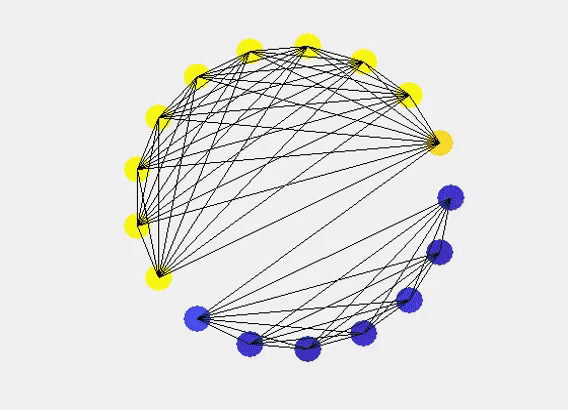

# Dynamics on Networks
This repository contains a lot of different implementations of dynamical systems in the context of different network architecures.

# Diffusion on Network
Heat diffusion is a classic example of a simple dynamical system that happens naturally in nature. Usually we see heat diffusion in a surface or a mesh in which each point
is in contact with a fixed number of neighboring points. We can generalize this to graphs: we start by initializing each node with a temperature and then let the system diffuse based on
the [Newton's law of cooling](https://en.wikipedia.org/wiki/Newton%27s_law_of_cooling), the heat is transfered from node `i` to node `j` is proportional to `phi_i-phi_j` if `i` and `j` are connected. given the thermal conductivity of `k`
the formula is:

However this can be done with the Laplacian matrix too read [this post]() for more info. The output will look like the following:

